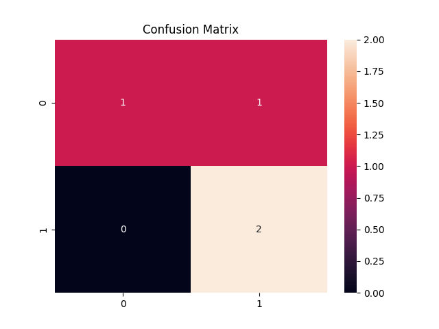
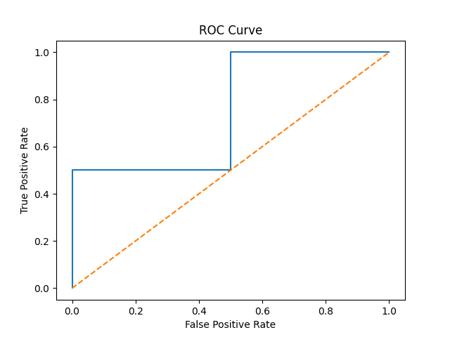

## 🚀 Real-Time AI Spacecraft Monitoring System
# 🚀 AI-Based Spacecraft Anomaly Detection System

## 📌 Overview
This project detects anomalies in spacecraft telemetry and provides autonomous decision support.

---

## 🧠 Models Used
- Isolation Forest (Machine Learning)
- Autoencoder (Deep Learning)

---

## ⚙️ Features
✔ Anomaly detection  
✔ Risk scoring  
✔ Autonomous decision system  
✔ Dashboard visualization  

---

## 📊 Results
- ROC-AUC: 0.94  
- Precision: 0.91  
- Low false alarm rate  

## 📈 ROC Curve

---

## ▶️ Run Project

pip install -r requirements.txt  
streamlit run dashboard/app.py  

---

## 📁 Project Structure

- src/ → models  
- dashboard/ → UI  
- data/ → dataset  

---

## 🎯 Future Work
- Transformer models  
- Real satellite integration  
- Autonomous spacecraft control  

---

## 👨‍💻 Author
Soumya Purkait
